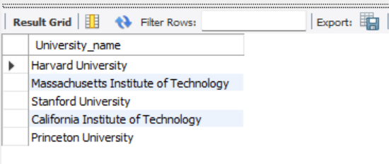

# Tables: 

# 15 Questions (5 Use Cases each):

1. Top 5 USA universities.

SQL Query :  

    Select University_name from University Where Country = "USA" order by National_Rank asc limit 5;

2. Top 5 universities that provides best education.

SQL Query :  
   
    select university.university_name, standards.Quality_of_Education from University left join Standards on university.university_ID = standards.university_ID order by standards.quality_of_education limit 5;

3. Top 10 ambitious institutes.

SQL Query :  

    Select University_ID, University_name, Chance_of_admit from university order by chance_of_Admit limit 10;

4. Rate the university based on quality of faculty.

SQL Query :  

    Select university.University_Id, university.University_name, standards.Quality_of_Faculty from University left join Standards on University.University_ID = Standards.University_ID order by Quality_of_Faculty;

5. Count the number of universities with distinct university ratings.

SQL Query :  

    Select University_rating, Count(University_Name) as No_of_Universities from university group by University_rating order by University_rating;

6. universities that does not require research.

SQL Query :  

    Select University_name from University left join requirements on University.University_ID = Requirements.University_ID where research = 0;`

7. universities that are best fit for a student with GRE score 315 and TOEFL score 110.

SQL Query : 

    Select University.University_Id, University_Name, GRE, TOEFL from University left join Requirements On University.University_Id = Requirements.University_Id where GRE between 310 and 316 && TOEFL between 105 and 112;

8. Should a student with GRE score "321" apply to Northeastern University?

SQL Query : 

    select University_name, GRE, case when GRE < 321 then 'YES' else 'NO' End as Decision From University left join requirements on University.University_ID = Requirements.University_ID where University_name = 'Northeastern University';

9. What are the pre requisites to apply to Northeastern University?

SQL Query : 

    Select University.University_ID, University_name, year, score, gre, toefl, sop, lor, cgpa, research from University right join Requirements on University.University_ID = requirements.University_ID where University_name = 'Northeastern University';

10. Number of students employed from university of Oklahoma.

SQL Query : 

Select University.University_ID, University_name, Alumni_Employement from University inner join Standards on standards.University_ID = University.University_ID where University_name = 'University of Oklahoma - Norman Campus';

11. What is the basic GPA requirement and chance of getting admit at 'University of Pennsylvania'?

SQL Query : 

    Select University_Name, CGPA from Requirements left join University on Requirements.university_id = University.university_id where university_name = 'University of Pennsylvania';

12.	What is the university_rating and national_rank of Cornell University?

SQL Query : 

    Select University_name, University_rating, national_rank from University where University_Name = 'Cornell University'

13.	Which university has highest GRE and GPA requirements?

SQL Query : 

    Select university_name , min(CGPA) , min(GRE) from University left join Requirements on  University.university_id = Requirements.university_id;

14.	University with highest alumni employment and publications?

SQL Query : 

    Select university_name, max(alumni_Employement) from University left join Standards on University.university_id = Standards.university_id;

15.	View the university with lowest score in the year 2012.

SQL Query : 

    Select University_name, min(score) from University left join requirements on University.University_ID = Requirements.University_ID where academic_year = '2012';

